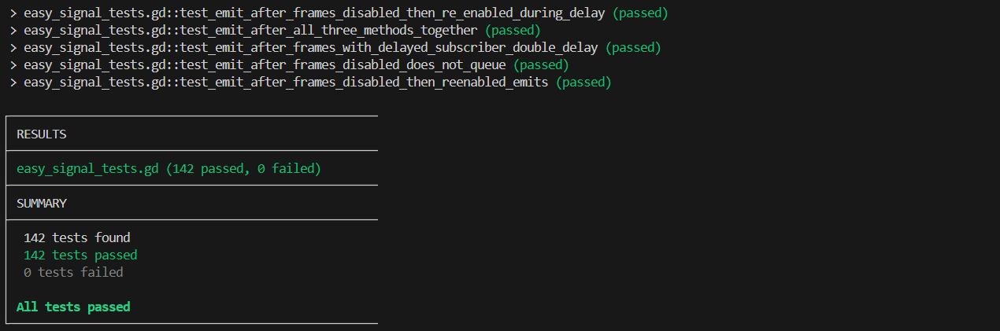
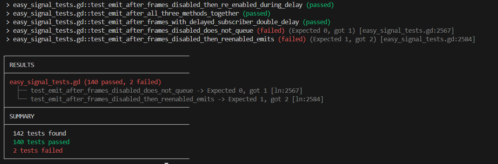

# GDTest - Lightweight GDScript Test Runner for Godot 4
[](LICENSE) [](https://godotengine.org/) [](https://docs.godotengine.org/en/stable/) [](#development-status)


GDTest is a minimal, script-based test runner for GDScript projects.  
It discovers and executes test scripts automatically in headless mode, providing simple async support, built-in assertions, and clear error reporting.

Perfect for quickly running tests from CLI without needing any setup in the editor.






---

## Features

- Automatic test discovery
- Built-in assertion helpers
- Supports `await`-based async tests
- Clear and structured error output
- No real setup required

---

## Usage


1. Copy the `gdtest/` folder anywhere in your project (e.g. under `res://src/gdtest/`).
2. Create your tests files and test logic ([see example below](#test-case-file-example)). Each test file must:
   - Be located at `res://tests/` (by default, can be changed in `gdtest.gd`).
   - Use the `.gd` extension  
   - Extend `GDTestCase`  
   - Define one or more test methods whose names start with `test_` (only those functions will be discovered and treated as tests)
3. Run your tests in headless mode using your Godot binary:

```bash
[path to godot binary] --headless -s [path to gdtest/gdtest.gd]
```

For examply, if you have an alias or PATH set:

```bash
godot4 --headless -s res://src/gdtest/gdtest.gd
```

Or you can use absolute paths like:

```bash
& "D:\Path_to_Godot_Binaries\Godot_v4.5-stable_mono_win64\Godot_v4.5-stable_mono_win64.exe" --headless -s res://src/gdtest/gdtest.gd
```

#### Test Case File Example

Below is an example of a few simple tests in a valid test case file, which would have to be placed for example at `[project root]/tests/my_demo_test_file.gd`:

```gdscript
# my_demo_test_file.gd
extends GDTestCase

func test_basic_addition() -> GDTestResult:
    # Basic assertion with default error message
    # Note that you must return the assertion
    return assert_equal(1 + 1, 2)


func test_basic_addition_with_custom_message() -> GDTestResult:
    var result: int = 1 + 1
    return assert_equal(result, 2, "1+1 should be 2, but we got " + str(result))


func test_async_example() -> GDTestResult:
    var dummy_node: Node = Node.new()

    Engine.get_main_loop().root.add_child(dummy_node)

    # Example of waiting for a frame to pass
    await Engine.get_main_loop().process_frame

    # Example of waiting for a set amount of time (1 second here)
    # Note that these are blocking operations, and that the test runner runs on a single thread/process
    # This means await statements will block the test runner from running other tests until this one finishes executing
    await Engine.get_main_loop().create_timer(1.0).timeout

    return assert_not_null(dummy_node.get_parent(), "Node should have a parent by now")


func test_with_manually_handled_fail_pass() -> GDTestResult:
    var dummy_node: Node = Node.new()

    # You can use custom or multiple assertions / verifications per test,
    # but since returning pass/fail exits the function body,
    # you can use a pattern like this one instead:
    if dummy_node == null or not is_instance_valid(dummy_node):
        return fail_test("Expected node to be valid after creation")

    dummy_node.free()

    # pass_test() and fail_test(error_message: String) are alternatives to using assertions
    if is_instance_valid(dummy_node):
        return fail_test("Expected node to no longer be valid after calling free()")

    return pass_test()
```

---

## Development Status

This is a work in progress. It is stable enough that I use it in my own projects without any issues so far.

CLI only at the moment, but Godot editor / GUI and IDE integration are things I would like to implement down the road.

Other planned features include launch arguments, selectively running or skipping tests, and improved reporting and navigation.

---

## License

This project is licensed under the MIT License. See the [LICENSE](LICENSE) file for details.

---

## Author

Jean-Marie Prévost

https://github.com/JeanMariePrevost
